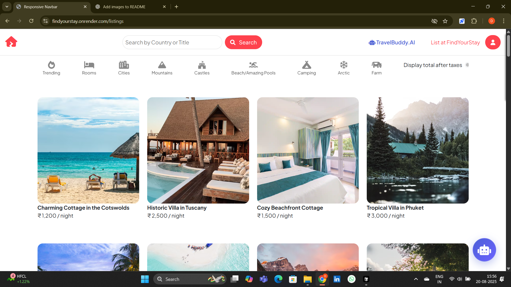
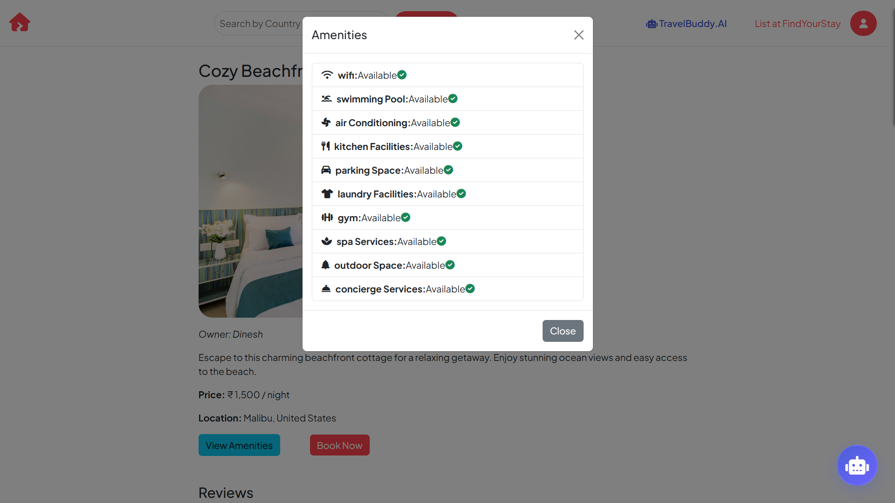
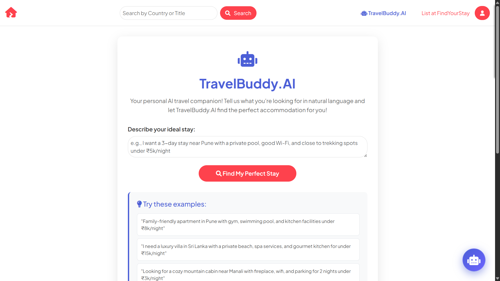
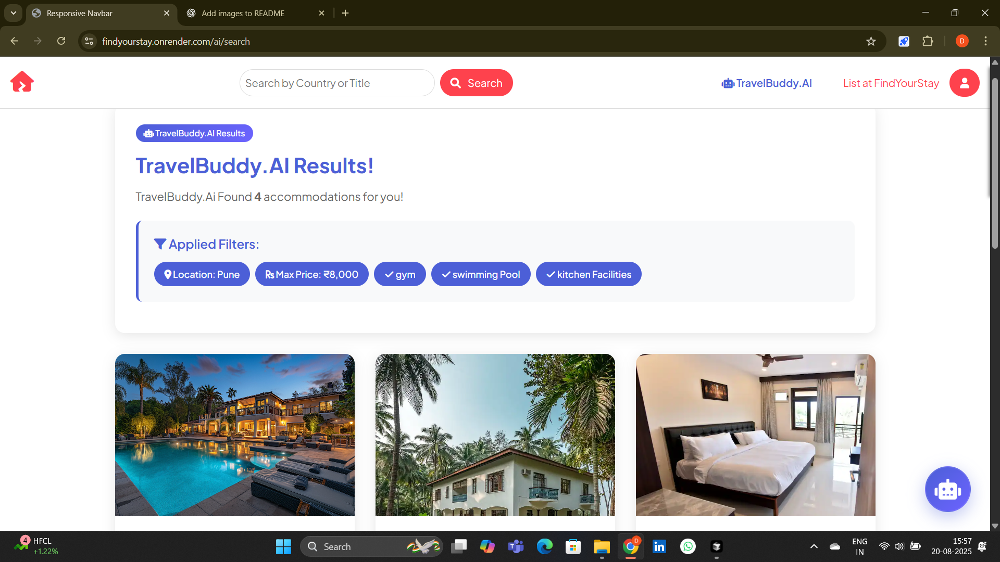
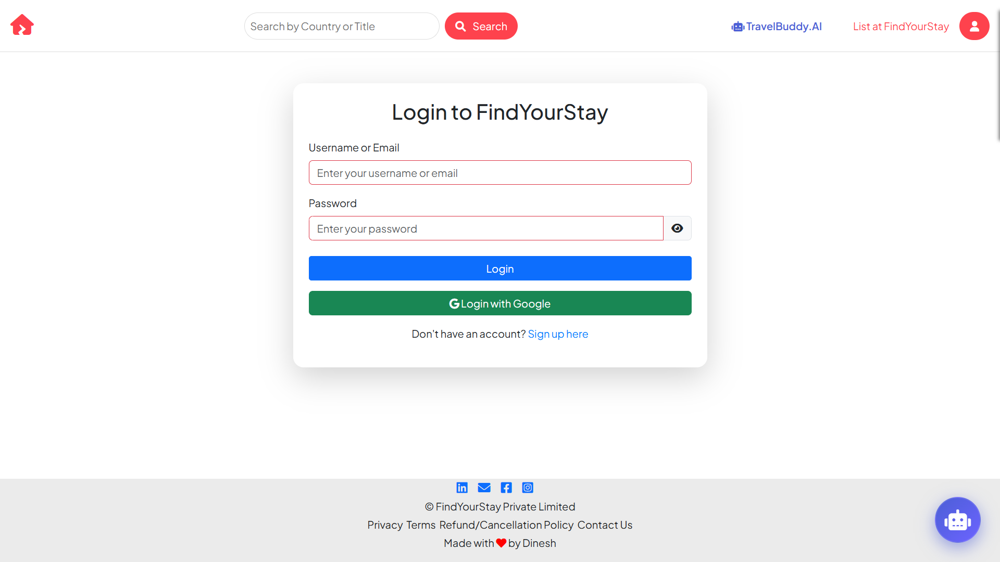

# FindYourStay 🌍🏡

## Description
I'm excited to share my latest project, **FindYourStay**, a full-stack web application that allows users to explore and book unique accommodations around the world. 🌎

## Features ✨
- 🔐 **User Authentication:** Secure sign-up and login functionalities.
- 🏠 **Listing Management:** Owners can easily create and manage their property listings.
- 🖼️ **Image Uploads:** Integrated with Cloudinary for seamless image storage and delivery.
- 🔍 **Advanced Search:** Search for properties based on location.
- ⭐ **Reviews:** Users can leave reviews on listings.
- 📱 **Responsive Design:** Fully responsive, ensuring a great experience on all devices.
- AI Travel conceirge

- 

## Usage 🏨
**FindYourStay** is useful for booking accommodations. Users can browse various listings, view details, and book their stay through the application.
## Live Link 🌐
Check out the live application here: [FindYourStay](https://findyourstay.onrender.com/listings)

## Contact 📬
For any inquiries or feedback, please reach out to me at [dineshaher2505@gmail.com](mailto:dineshaher2505@gmail.com).
